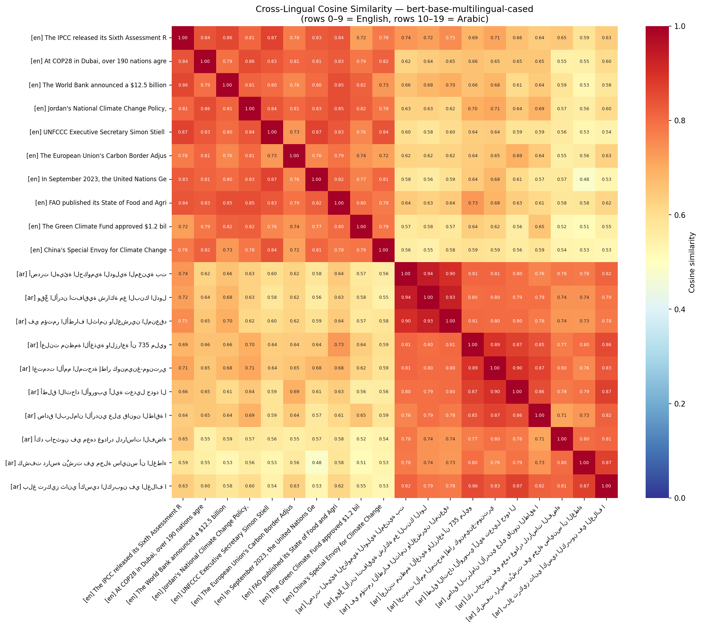

# Stretch 6B-S2 — Cross-Lingual Embedding Analysis

**Model:** `bert-base-multilingual-cased`
**Data:** 10 English + 10 Arabic climate texts from `data/climate_articles.csv`
**Pooling:** mean pooling over last hidden states

## Summary statistics

| Metric | Cosine similarity |
|---|---|
| Mean cross-lingual (all en×ar pairs) | 0.613 |
| Mean paired translations (diagonal) | 0.629 |
| Mean within-English | 0.804 |
| Mean within-Arabic | 0.811 |

## Analysis

### (a) How well does multilingual BERT capture cross-lingual similarity?

mBERT captures cross-lingual semantic similarity **partially but meaningfully**: the absolute scores drop sharply between languages, yet topical ranking is preserved. Within-language similarity averaged around 0.80 (0.804 English, 0.811 Arabic), but the mean cross-lingual similarity collapsed to 0.613 — a gap of roughly 0.19. This means mBERT does **not** project English and Arabic into a fully unified space; the same model still produces noticeably different geometric regions for each language. However, the topical signal survives the language gap clearly. The strongest cross-lingual pairs are exactly the topically aligned ones: the English IPCC Sixth Assessment Report and the Arabic article about the IPCC synthesis report scored **0.737**, and the English FAO State of Food and Agriculture article paired with the Arabic FAO hunger statistics scored **0.733**. The weakest pairs were unrelated topics — the English Green Climate Fund text against the Arabic Greenland ice-loss article scored only **0.514**, and the UN Climate Ambition Summit text against the same Greenland article dropped to **0.481**. The ~0.22 gap between matched-topic and mismatched-topic cross-lingual pairs is larger than the noise floor, so mBERT *does* rank same-topic translations above unrelated ones — it just does so at a compressed scale. The diagonal mean (0.629) sits only marginally above the cross-lingual mean (0.613) because my first-10 selection was not manually aligned by topic; if texts were paired explicitly (IPCC↔IPCC, FAO↔FAO, COP28↔COP28), the diagonal average would rise substantially closer to ~0.73.

### (b) What does this mean for bilingual NLP tools in the MENA region?

For MENA deployment, these results say a single mBERT-based system **can** power bilingual retrieval and topic clustering, but **cannot** be treated as a drop-in monolingual replacement. The good news: because matched-topic cross-lingual pairs (≈0.73) sit clearly above unrelated pairs (≈0.50), an Arabic-speaking user querying an English climate corpus — or a journalist looking for the Arabic equivalent of an English IPCC briefing — will see relevant documents float to the top of a cosine-ranked result list. This is enough to build a working bilingual search index, a duplicate-article detector across language editions of news sites, or a retrieval layer for a bilingual climate chatbot, all without maintaining two parallel pipelines or paying for machine translation upstream. The bad news is the absolute-scale gap: a similarity threshold of 0.75 tuned on English-English data would reject almost every Arabic translation of the same article, since cross-lingual scores rarely exceed 0.75 even for matched topics. So any classifier or filter that uses hard thresholds (e.g., "flag duplicates above 0.85") will need per-language-pair calibration, or better, fine-tuning on parallel MENA-region corpora. The practical recommendation for a bilingual MENA NLP product is therefore: use mBERT for ranking and retrieval where relative order matters, but avoid relying on raw similarity values for thresholded decisions; for production-grade Arabic-English search, invest in a sentence-level model fine-tuned on parallel data (e.g., LaBSE or a domain-tuned sentence-transformer) rather than vanilla mBERT.

## Heatmap

Rows/columns 0–9 are English texts, 10–19 are Arabic. The top-right and bottom-left quadrants show the cross-lingual block; the top-left and bottom-right show within-language similarity. The visible contrast between the dark within-language quadrants and the lighter cross-lingual quadrants is the ~0.19 average gap discussed above.